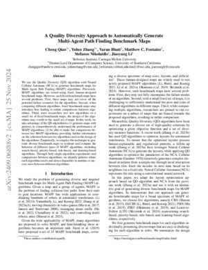
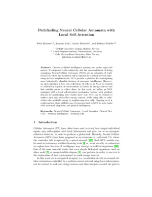

<!-- This file was automatically created on 2025-03-12 16:24:23 UTC. Any manual changes will be lost! -->
# Awesome Neural Cellular Automata
A list of paper and resources regarding Neural Cellular Automata. Last updated: 2025-03-12.

> [!NOTE]
> This repository has been researched, compiled, and maintained to the best of my knowledge and ability.
> While I strive for accuracy and completeness, there may be mistakes or updates needed over time.
> I welcome suggestions, improvements, and contributions from the community.
> Please feel free to open an issue or submit a pull request if you have any recommendations or changes.
>
> To contribute, please update the `papers.yaml` file.
> Direct updates to `Readme.md` will be overwritten in the next commit.
>
> Thank you for your support and collaboration!

## Seminal Paper introducing Neural Cellular Automata
<table>
<tr>
<td width="150px">

</td>
<td>

### Growing Neural Cellular Automata
Published on **2020-02-11** by

Alexander **Mordvintsev**, Ettore **Randazzo**, Eyvind **Niklasson**, Michael **Levin**

[Code](https://colab.research.google.com/github/google-research/self-organising-systems/blob/master/notebooks/growing_ca.ipynb) | [Project Page](https://distill.pub/2020/growing-ca/)

<b>Abstract</b>

Training an end-to-end differentiable, self-organising cellular automata model of morphogenesis, able to both grow and regenerate specific patterns.

</td>
</tr>

</table>

## Implementations
- [Original reference](https://colab.research.google.com/github/google-research/self-organising-systems/blob/master/notebooks/growing_ca.ipynb)
- [CAX](https://github.com/maxencefaldor/cax) - Cellular Automata in JAX

## List of Papers

### 2025
<table>

<tr>
<td width="150px">

</td>
<td>

#### Neural Cellular Automata for Decentralized Sensing using a Soft Inductive Sensor Array for Distributed Manipulator Systems
Published on **2025-02-03** by

Bailey **Dacre**, Nicolas **Bessone**, Matteo Lo **Preti**, Diana **Cafiso**, Rodrigo **Moreno**, Andrés **Faíña**, Lucia **Beccai**

[Paper](https://link.springer.com/chapter/10.1007/978-3-031-70415-4_6) | [Arxiv](https://arxiv.org/abs/2502.01242)

<b>Abstract</b>

In Distributed Manipulator Systems (DMS), decentralization is a highly desirable property as it promotes robustness and facilitates scalability by distributing computational burden and eliminating singular points of failure. However, current DMS typically utilize a centralized approach to sensing, such as single-camera computer vision systems. This centralization poses a risk to system reliability and offers a significant limiting factor to system size. In this work, we introduce a decentralized approach for sensing and in a Distributed Manipulator Systems using Neural Cellular Automata (NCA). Demonstrating a decentralized sensing in a hardware implementation, we present a novel inductive sensor board designed for distributed sensing and evaluate its ability to estimate global object properties, such as the geometric center, through local interactions and computations. Experiments demonstrate that NCA-based sensing networks accurately estimate object position at 0.24 times the inter sensor distance. They maintain resilience under sensor faults and noise, and scale seamlessly across varying network sizes. These findings underscore the potential of local, decentralized computations to enable scalable, fault-tolerant, and noise-resilient object property estimation in DMS

</td>
</tr>

<tr>
<td width="150px">

</td>
<td>

#### Neural Cellular Automata and Deep Equilibrium Models
Published on **2025-01-07** by

Zhibai **Jia**

[Arxiv](https://arxiv.org/abs/2501.03573)

<b>Abstract</b>

This essay discusses the connections and differences between two emerging paradigms in deep learning, namely Neural Cellular Automata and Deep Equilibrium Models, and train a simple Deep Equilibrium Convolutional model to demonstrate the inherent similarity of NCA and DEQ based methods. Finally, this essay speculates about ways to combine theoretical and practical aspects of both approaches for future research.

</td>
</tr>

<tr>
<td width="150px">

</td>
<td>

#### MedSegDiffNCA: Diffusion Models With Neural Cellular Automata for Skin Lesion Segmentation
Published on **2025-01-05** by

Avni **Mittal**, John **Kalkhof**, Anirban **Mukhopadhyay**, Arnav **Bhavsar**

[Arxiv](https://arxiv.org/abs/2501.02447)

<b>Abstract</b>

Denoising Diffusion Models (DDMs) are widely used for high-quality image generation and medical image segmentation but often rely on Unet-based architectures, leading to high computational overhead, especially with high-resolution images. This work proposes three NCA-based improvements for diffusion-based medical image segmentation. First, Multi-MedSegDiffNCA uses a multilevel NCA framework to refine rough noise estimates generated by lower level NCA models. Second, CBAM-MedSegDiffNCA incorporates channel and spatial attention for improved segmentation. Third, MultiCBAM-MedSegDiffNCA combines these methods with a new RGB channel loss for semantic guidance. Evaluations on Lesion segmentation show that MultiCBAM-MedSegDiffNCA matches Unet-based model performance with dice score of 87.84% while using 60-110 times fewer parameters, offering a more efficient solution for low resource medical settings.

</td>
</tr>

</table>

### 2024
<table>

<tr>
<td width="150px">

</td>
<td>

#### NCAdapt: Dynamic adaptation with domain-specific Neural Cellular Automata for continual hippocampus segmentation
Published on **2024-10-30** by

Amin **Ranem**, John **Kalkhof**, Anirban **Mukhopadhyay**

[Arxiv](https://arxiv.org/abs/2410.23368) | [Code](https://github.com/MECLabTUDA/NCAdapt)

<b>Abstract</b>

Continual learning (CL) in medical imaging presents a unique challenge, requiring models to adapt to new domains while retaining previously acquired knowledge. We introduce NCAdapt, a Neural Cellular Automata (NCA) based method designed to address this challenge. NCAdapt features a domain-specific multi-head structure, integrating adaptable convolutional layers into the NCA backbone for each new domain encountered. After initial training, the NCA backbone is frozen, and only the newly added adaptable convolutional layers, consisting of 384 parameters, are trained along with domain-specific NCA convolutions. We evaluate NCAdapt on hippocampus segmentation tasks, benchmarking its performance against Lifelong nnU-Net and U-Net models with state-of-the-art (SOTA) CL methods. Our lightweight approach achieves SOTA performance, underscoring its effectiveness in addressing CL challenges in medical imaging. Upon acceptance, we will make our code base publicly accessible to support reproducibility and foster further advancements in medical CL.

</td>
</tr>

<tr>
<td width="150px">

</td>
<td>

#### NCA-Morph: Medical Image Registration with Neural Cellular Automata
Published on **2024-10-29** by

Amin **Ranem**, John **Kalkhof**, Anirban **Mukhopadhyay**

[Arxiv](https://arxiv.org/abs/2410.22265) | [Code](https://github.com/MECLabTUDA/NCA-Morph)

<b>Abstract</b>

Medical image registration is a critical process that aligns various patient scans, facilitating tasks like diagnosis, surgical planning, and tracking. Traditional optimization based methods are slow, prompting the use of Deep Learning (DL) techniques, such as VoxelMorph and Transformer-based strategies, for faster results. However, these DL methods often impose significant resource demands. In response to these challenges, we present NCA-Morph, an innovative approach that seamlessly blends DL with a bio-inspired communication and networking approach, enabled by Neural Cellular Automata (NCAs). NCA-Morph not only harnesses the power of DL for efficient image registration but also builds a network of local communications between cells and respective voxels over time, mimicking the interaction observed in living systems. In our extensive experiments, we subject NCA-Morph to evaluations across three distinct 3D registration tasks, encompassing Brain, Prostate and Hippocampus images from both healthy and diseased patients. The results showcase NCA-Morph's ability to achieve state-of-the-art performance. Notably, NCA-Morph distinguishes itself as a lightweight architecture with significantly fewer parameters; 60% and 99.7% less than VoxelMorph and TransMorph. This characteristic positions NCA-Morph as an ideal solution for resource-constrained medical applications, such as primary care settings and operating rooms.

</td>
</tr>

<tr>
<td width="150px">

</td>
<td>

#### A Quality Diversity Approach to Automatically Generate Multi-Agent Path Finding Benchmark Maps
Published on **2024-09-10** by

Cheng **Qian**, Yulun **Zhang**, Varun **Bhatt**, Matthew Christopher **Fontaine**, Stefanos **Nikolaidis**, Jiaoyang **Li**

[Paper](https://ojs.aaai.org/index.php/SOCS/article/view/31580) | [Arxiv](https://arxiv.org/abs/2409.06888)

<b>Abstract</b>

We use the Quality Diversity (QD) algorithm with Neural Cellular Automata (NCA) to generate benchmark maps for Multi-Agent Path Finding (MAPF) algorithms. Previously, MAPF algorithms are tested using fixed, human-designed benchmark maps. However, such fixed benchmark maps have several problems. First, these maps may not cover all the potential failure scenarios for the algorithms. Second, when comparing different algorithms, fixed benchmark maps may introduce bias leading to unfair comparisons between algorithms. In this work, we take advantage of the QD algorithm and NCA with different objectives and diversity measures to generate maps with patterns to comprehensively understand the performance of MAPF algorithms and be able to make fair comparisons between two MAPF algorithms to provide further information on the selection between two algorithms. Empirically, we employ this technique to generate diverse benchmark maps to evaluate and compare the behavior of different types of MAPF algorithms such as bounded-suboptimal algorithms, suboptimal algorithms, and reinforcement-learning-based algorithms. Through both single-planner experiments and comparisons between algorithms, we identify patterns where each algorithm excels and detect disparities in runtime or success rates between different algorithms.

</td>
</tr>

<tr>
<td width="150px">

</td>
<td>

#### NoiseNCA: Noisy Seed Improves Spatio-Temporal Continuity of Neural Cellular Automata
Published on **2024-04-09** by

Ehsan **Pajouheshgar**, Yitao **Xu**, Sabine **Süsstrunk**

[Project Page](https://noisenca.github.io/) | [Paper](https://direct.mit.edu/isal/article/doi/10.1162/isal_a_00785/123473/NoiseNCA-Noisy-Seed-Improves-Spatio-Temporal) | [Arxiv](https://arxiv.org/abs/2404.06279) | [Code](https://github.com/IVRL/NoiseNCA)

<b>Abstract</b>

Neural Cellular Automata (NCA) is a class of Cellular Automata where the update rule is parameterized by a neural network that can be trained using gradient descent. In this paper, we focus on NCA models used for texture synthesis, where the update rule is inspired by partial differential equations (PDEs) describing reaction-diffusion systems. To train the NCA model, the spatio-termporal domain is discretized, and Euler integration is used to numerically simulate the PDE. However, whether a trained NCA truly learns the continuous dynamic described by the corresponding PDE or merely overfits the discretization used in training remains an open question. We study NCA models at the limit where space-time discretization approaches continuity. We find that existing NCA models tend to overfit the training discretization, especially in the proximity of the initial condition, also called "seed". To address this, we propose a solution that utilizes uniform noise as the initial condition. We demonstrate the effectiveness of our approach in preserving the consistency of NCA dynamics across a wide range of spatio-temporal granularities. Our improved NCA model enables two new test-time interactions by allowing continuous control over the speed of pattern formation and the scale of the synthesized patterns. We demonstrate this new NCA feature in our interactive online demo. Our work reveals that NCA models can learn continuous dynamics and opens new venues for NCA research from a dynamical systems' perspective.

</td>
</tr>

</table>

### 2023
<table>

<tr>
<td width="150px">

</td>
<td>

#### Mordvintsev Hexcells
Published on **2023-11-24** by

Alexander **Mordvintsev**

[Project Page](https://znah.net/hexells/)

<b>Abstract</b>

</td>
</tr>

<tr>
<td width="150px">

</td>
<td>

#### Mesh Neural Cellular Automata
Published on **2023-11-05** by

Ehsan **Pajouheshgar**, Yitao **Xu**, Alexander **Mordvintsev**, Eyvind **Niklasson**, Tong **Zhang**, Sabine **Süsstrunk**

[Project Page](https://meshnca.github.io/) | [Arxiv](https://arxiv.org/abs/2311.02820) | [Code](https://github.com/IVRL/MeshNCA)

<b>Abstract</b>

Modeling and synthesizing textures are essential for enhancing the realism of virtual environments. Methods that directly synthesize textures in 3D offer distinct advantages to the UV-mapping-based methods as they can create seamless textures and align more closely with the ways textures form in nature. We propose Mesh Neural Cellular Automata (MeshNCA), a method for directly synthesizing dynamic textures on 3D meshes without requiring any UV maps. MeshNCA is a generalized type of cellular automata that can operate on a set of cells arranged on a non-grid structure such as vertices of a 3D mesh. While only being trained on an Icosphere mesh, MeshNCA shows remarkable generalization and can synthesize textures on any mesh in real time after the training. Additionally, it accommodates multi-modal supervision and can be trained using different targets such as images, text prompts, and motion vector fields. Moreover, we conceptualize a way of grafting trained MeshNCA instances, enabling texture interpolation. Our MeshNCA model enables real-time 3D texture synthesis on meshes and allows several user interactions including texture density/orientation control, a grafting brush, and motion speed/direction control. Finally, we implement the forward pass of our MeshNCA model using the WebGL shading language and showcase our trained models in an online interactive demo which is accessible on personal computers and smartphones. Our demo and the high resolution version of this PDF are available at https://meshnca.github.io/.

</td>
</tr>

<tr>
<td width="150px">

</td>
<td>

#### Arbitrarily Scalable Environment Generators via Neural Cellular Automata
Published on **2023-10-28** by

Yulun **Zhang**, Matthew C. **Fontaine**, Varun **Bhatt**, Stefanos **Nikolaidis**, Jiaoyang **Li**

[Arxiv](https://arxiv.org/abs/2310.18622) | [Code](https://github.com/lunjohnzhang/warehouse_env_gen_nca_public)

<b>Abstract</b>

We study the problem of generating arbitrarily large environments to improve the throughput of multi-robot systems. Prior work proposes Quality Diversity (QD) algorithms as an effective method for optimizing the environments of automated warehouses. However, these approaches optimize only relatively small environments, falling short when it comes to replicating real-world warehouse sizes. The challenge arises from the exponential increase in the search space as the environment size increases. Additionally, the previous methods have only been tested with up to 350 robots in simulations, while practical warehouses could host thousands of robots. In this paper, instead of optimizing environments, we propose to optimize Neural Cellular Automata (NCA) environment generators via QD algorithms. We train a collection of NCA generators with QD algorithms in small environments and then generate arbitrarily large environments from the generators at test time. We show that NCA environment generators maintain consistent, regularized patterns regardless of environment size, significantly enhancing the scalability of multi-robot systems in two different domains with up to 2,350 robots. Additionally, we demonstrate that our method scales a single-agent reinforcement learning policy to arbitrarily large environments with similar patterns. We include the source code at \url{https://github.com/lunjohnzhang/warehouse_env_gen_nca_public}.

</td>
</tr>

<tr>
<td width="150px">

</td>
<td>

#### Reconstructing microstructures from statistical descriptors using neural cellular automata
Published on **2023-09-28** by

Paul **Seibert**, Alexander **Raßloff**, Yichi **Zhang**, Karl **Kalina**, Paul **Reck**, Daniel **Peterseim**, Markus **Kästner**

[Paper](https://link.springer.com/article/10.1007/s40192-023-00335-1) | [Arxiv](https://arxiv.org/abs/2309.16195)

<b>Abstract</b>

The problem of generating microstructures of complex materials in silico has been approached from various directions including simulation, Markov, deep learning and descriptor-based approaches. This work presents a hybrid method that is inspired by all four categories and has interesting scalability properties. A neural cellular automaton is trained to evolve microstructures based on local information. Unlike most machine learning-based approaches, it does not directly require a data set of reference micrographs, but is trained from statistical microstructure descriptors that can stem from a single reference. This means that the training cost scales only with the complexity of the structure and associated descriptors. Since the size of the reconstructed structures can be set during inference, even extremely large structures can be efficiently generated. Similarly, the method is very efficient if many structures are to be reconstructed from the same descriptor for statistical evaluations. The method is formulated and discussed in detail by means of various numerical experiments, demonstrating its utility and scalability.

</td>
</tr>

<tr>
<td width="150px">

</td>
<td>

#### Automata Quest: NCAs as a Video Game Life Mechanic
Published on **2023-09-23** by

Hiroki **Sato**, Tanner **Lund**, Takahide **Yoshida**, Atsushi **Masumori**

[Arxiv](https://arxiv.org/abs/2309.14364) | [Code](https://github.com/IkegLab/GNCA_invader)

<b>Abstract</b>

We study life over the course of video game history as represented by their mechanics. While there have been some variations depending on genre or "character type", we find that most games converge to a similar representation. We also examine the development of Conway's Game of Life (one of the first zero player games) and related automata that have developed over the years. With this history in mind, we investigate the viability of one popular form of automata, namely Neural Cellular Automata, as a way to more fully express life within video game settings and innovate new game mechanics or gameplay loops.

</td>
</tr>

<tr>
<td width="150px">

</td>
<td>

#### Pathfinding Neural Cellular Automata with Local Self-Attention
Published on **2023-08-30** by

Felix **Reimers**, Sanyam **Jain**, Aarati **Shrestha**, Stafano **Nichele**

[Paper](https://zenodo.org/records/8275919) | [Code](https://github.com/Deskt0r/LocalAttentionNCA)

<b>Abstract</b>

Abstract: Current artificial intelligence systems are rather rigid and narrow, if compared to the adaptivity and the open-endedness of living organisms. Neural Cellular Automata (NCA) are an extension of traditional CA, where the transition rule is replaced by a neural network operating on local neighborhoods. NCA provide a platform for investigating more biologically plausible features of emergent intelligence. However, an open question is how can collections of cells in an NCA be trained to collectively explore an environment in search for energy sources and find suitable paths to collect them. In this work, we utilize an NCA equipped with a local self-attention mechanism trained with gradient descent for pathfinding. Our results show that NCA can be trained to achieve such task and collect energy sources, while being able to redistribute the available energy to neighboring alive cells. Ongoing work is exploring how those abilities may be incorporated in NCA to solve tasks with increased adaptivity and general intelligence.

</td>
</tr>

<tr>
<td width="150px">

</td>
<td>

#### Hierarchical Neural Cellular Automata
Published on **2023-07-24** by

Ritu **Pande**, Daniele **Grattarola**

[Paper](https://dl.acm.org/doi/10.1145/3638529.3654150) | [Code](https://github.com/ngaylinn/mocs-final)

<b>Abstract</b>

Abstract. As opposed to the traditional view wherein intelligence was believed to be a result of centralised complex monolithic rules, it is now believed that the phenomenon is multi-scale, modular and emergent (self-organising) in nature. At each scale, the constituents of an intelligent system are cognitive units driven towards a specific goal, in a specific problem space—physical, molecular, metabolic, morphological, etc. Recently, Neural Cellular Automata (NCA) have proven to be effective in simulating many evolutionary tasks, in morphological space, as self-organising dynamical systems. They are however limited in their capacity to emulate complex phenomena seen in nature such as cell differentiation (change in cell’s phenotypical and functional characteristics), metamorphosis (transformation to a new morphology after evolving to another) and apoptosis (programmed cell death). Inspired by the idea of multi-scale emergence of intelligence, we present Hierarchical NCA, a self-organising model that allows for phased, feedback-based, complex emergent behaviour. We show that by modelling emergent behaviour at two different scales in a modular hierarchy with dedicated goals, we can effectively simulate many complex evolutionary morphological tasks. Finally, we discuss the broader impact and application of this concept in areas outside biological process modelling.

</td>
</tr>

<tr>
<td width="150px">

</td>
<td>

#### Biomaker CA: a Biome Maker project using Cellular Automata
Published on **2023-07-18** by

Ettore **Randazzo**, Alexander **Mordvintsev**

[Arxiv](https://arxiv.org/abs/2307.09320) | [Project Page](https://google-research.github.io/self-organising-systems/2023/biomaker-ca/) | [Code](https://github.com/google-research/self-organising-systems/tree/master/self_organising_systems/biomakerca)

<b>Abstract</b>

We introduce Biomaker CA: a Biome Maker project using Cellular Automata (CA). In Biomaker CA, morphogenesis is a first class citizen and small seeds need to grow into plant-like organisms to survive in a nutrient starved environment and eventually reproduce with variation so that a biome survives for long timelines. We simulate complex biomes by means of CA rules in 2D grids and parallelize all of its computation on GPUs through the Python JAX framework. We show how this project allows for several different kinds of environments and laws of ’physics’, alongside different model architectures and mutation strategies. We further analyze some configurations to show how plant agents can grow, survive, reproduce, and evolve, forming stable and unstable biomes. We then demonstrate how one can meta-evolve models to survive in a harsh environment either through end-toend meta-evolution or by a more surgical and efficient approach, called Petri dish meta-evolution. Finally, we show how to perform interactive evolution, where the user decides how to evolve a plant model interactively and then deploys it in a larger environment. We open source Biomaker CA at: https://tinyurl.com/2x8yu34s.

</td>
</tr>

<tr>
<td width="150px">

</td>
<td>

#### Critical Neural Cellular Automata
Published on **2023-06-19** by

Sidney **Pontes-Filho**, Stefano **Nichele**, Mikkel **Lepperød**

[Paper](https://www.nichele.eu/ALIFE-DistributedGhost/2-Pontes.pdf)

<b>Abstract</b>

</td>
</tr>

<tr>
<td width="150px">

</td>
<td>

#### Neural Cellular Automata Can Respond to Signals
Published on **2023-05-22** by

James **Stovold**

[Paper](https://direct.mit.edu/isal/article/doi/10.1162/isal_a_00567/116835/Neural-Cellular-Automata-Can-Respond-to-Signals) | [Arxiv](https://arxiv.org/abs/2305.12971) | [Code](https://github.com/jstovold/ALIFE2023)

<b>Abstract</b>

Neural Cellular Automata (NCAs) are a model of morphogenesis, capable of growing two-dimensional artificial organisms from a single seed cell. In this paper, we show that NCAs can be trained to respond to signals. Two types of signal are used: internal (genomically-coded) signals, and external (environmental) signals. Signals are presented to a single pixel for a single timestep.

</td>
</tr>

<tr>
<td width="150px">

</td>
<td>

#### Self-Replication, Spontaneous Mutations, and Exponential Genetic Drift in Neural Cellular Automata
Published on **2023-05-22** by

Lana **Sinapayen**

[Paper](https://direct.mit.edu/isal/article/doi/10.1162/isal_a_00591/116893/Self-Replication-Spontaneous-Mutations-and) | [Arxiv](https://arxiv.org/abs/2305.13043) | [Code](https://github.com/LanaSina/NCA_self_replication) | [Videos](https://youtube.com/playlist?list=PLYuu1RcSnrYRhophmfolv_lmx7Qz8AP1P)

<b>Abstract</b>

This paper reports on patterns exhibiting self-replication with spontaneous, inheritable mutations and exponential genetic drift in Neural Cellular Automata. Despite the models not being explicitly trained for mutation or inheritability, the descendant patterns exponentially drift away from ancestral patterns, even when the automaton is deterministic. While this is far from being the first instance of evolutionary dynamics in a cellular automaton, it is the first to do so by exploiting the power and convenience of Neural Cellular Automata, arguably increasing the space of variations and the opportunity for Open Ended Evolution.

</td>
</tr>

<tr>
<td width="150px">

</td>
<td>

#### Training Topology With Graph Neural Cellular Automata
Published on **2023-05-12** by

Daniel **Dwyer**, Maxwell M. **Omwenga**

[Project Page](https://danielegrattarola.github.io/posts/2021-11-08/graph-neural-cellular-automata.html) | [Paper](https://ieeexplore.ieee.org/document/10187381) | [Arxiv](https://arxiv.org/abs/2110.14237) | [Code](https://github.com/danielegrattarola/GNCA)

<b>Abstract</b>

Graph neural cellular automata are a recently introduced class of computational models that extend neural cellular automata to arbitrary graphs. They are promising in various applications based on preliminary test results and the successes of related computational models, such as neural cellular automata and convolutional and graph neural networks. However, all previous graph neural cellular automaton implementations have only been able to modify data associated with the vertices and edges, not the underlying graph topology itself. Here we introduce a method of encoding graph topology information as vertex data by assigning each edge and vertex an opacity value, which is the confidence with which the model thinks that that edge or vertex should be present in the output graph. Graph neural cellular automata equipped with this encoding method, henceforth referred to as translucent graph neural cellular automata, were tested in their ability to learn to reconstruct graphs from random subgraphs of them as a proof of concept. The results suggest that translucent graph neural cellular automata are capable of this task, albeit with optimal learning rates highly dependent on the graph to be reconstructed.

</td>
</tr>

<tr>
<td width="150px">

</td>
<td>

#### Neural Cellular Automata for Solidification Microstructure Modelling
Published on **2023-04-05** by

Jian **Tang**, Siddhant **Kumar**, Laura **De Lorenzis**, Ehsan **Hosseini**

[Arxiv](https://arxiv.org/abs/2304.02354) | [Code](https://github.com/HighTempIntegrity/JianTang-NCA01)

<b>Abstract</b>

We propose Neural Cellular Automata (NCA) to simulate the microstructure development during the solidification process in metals. Based on convolutional neural networks, NCA can learn essential solidification features, such as preferred growth direction and competitive grain growth, and are up to six orders of magnitude faster than the conventional Cellular Automata (CA). Notably, NCA delivers reliable predictions also outside their training range, which indicates that they learn the physics of the solidification process. While in this study we employ data produced by CA for training, NCA can be trained based on any microstructural simulation data, e.g. from phase-field models.

</td>
</tr>

<tr>
<td width="150px">

</td>
<td>

#### DyNCA: Real-time Dynamic Texture Synthesis Using Neural Cellular Automata
Published on **2023-03-30** by

Ehsan **Pajouheshgar**, Yitao **Xu**, Tong **Zhang**, Sabine **Süsstrunk**

[Project Page](https://dynca.github.io/) | [Arxiv](https://arxiv.org/abs/2211.11417) | [Code](https://github.com/IVRL/DyNCA) | [Video](https://www.youtube.com/watch?v=ELZC2mX5Z9U)

<b>Abstract</b>

Current Dynamic Texture Synthesis (DyTS) models can synthesize realistic videos. However, they require a slow iterative optimization process to synthesize a single fixed-size short video, and they do not offer any post-training control over the synthesis process. We propose Dynamic Neural Cellular Automata (DyNCA), a framework for real-time and controllable dynamic texture synthesis. Our method is built upon the recently introduced NCA models and can synthesize infinitely long and arbitrary-sized realistic video textures in real time. We quantitatively and qualitatively evaluate our model and show that our synthesized videos appear more realistic than the existing results. We improve the SOTA DyTS performance by $2\sim 4$ orders of magnitude. Moreover, our model offers several real-time video controls including motion speed, motion direction, and an editing brush tool. We exhibit our trained models in an online interactive demo that runs on local hardware and is accessible on personal computers and smartphones.

</td>
</tr>

<tr>
<td width="150px">

</td>
<td>

#### Growing Steerable Neural Cellular Automata
Published on **2023-02-19** by

Ettore **Randazzo**, Alexander **Mordvintsev**, Craig **Fouts**

[Arxiv](https://arxiv.org/abs/2302.10197) | [Code](ttps://github.com/google-research/self-organising-systems/tree/master/isotropic_nca)

<b>Abstract</b>

Neural Cellular Automata (NCA) models have shown remarkable capacity for pattern formation and complex global behaviors stemming from local coordination. However, in the original implementation of NCA, cells are incapable of adjusting their own orientation, and it is the responsibility of the model designer to orient them externally. A recent isotropic variant of NCA (Growing Isotropic Neural Cellular Automata) makes the model orientation-independent - cells can no longer tell up from down, nor left from right - by removing its dependency on perceiving the gradient of spatial states in its neighborhood. In this work, we revisit NCA with a different approach: we make each cell responsible for its own orientation by allowing it to "turn" as determined by an adjustable internal state. The resulting Steerable NCA contains cells of varying orientation embedded in the same pattern. We observe how, while Isotropic NCA are orientation-agnostic, Steerable NCA have chirality: they have a predetermined left-right symmetry. We therefore show that we can train Steerable NCA in similar but simpler ways than their Isotropic variant by: (1) breaking symmetries using only two seeds, or (2) introducing a rotation-invariant training objective and relying on asynchronous cell updates to break the up-down symmetry of the system.

</td>
</tr>

<tr>
<td width="150px">

</td>
<td>

#### Med-NCA: Robust and Lightweight Segmentation with Neural Cellular Automata
Published on **2023-02-07** by

John **Kalkhof**, Camila **González**, Anirban **Mukhopadhyay**

[Paper](https://link.springer.com/chapter/10.1007/978-3-031-34048-2_54) | [Arxiv](https://arxiv.org/abs/2302.03473) | [Code](https://github.com/MECLabTUDA/Med-NCA)

<b>Abstract</b>

Access to the proper infrastructure is critical when performing medical image segmentation with Deep Learning. This requirement makes it difficult to run state-of-the-art segmentation models in resource-constrained scenarios like primary care facilities in rural areas and during crises. The recently emerging field of Neural Cellular Automata (NCA) has shown that locally interacting one-cell models can achieve competitive results in tasks such as image generation or segmentations in low-resolution inputs. However, they are constrained by high VRAM requirements and the difficulty of reaching convergence for high-resolution images. To counteract these limitations we propose Med-NCA, an end-to-end NCA training pipeline for high-resolution image segmentation. Our method follows a two-step process. Global knowledge is first communicated between cells across the downscaled image. Following that, patch-based segmentation is performed. Our proposed Med-NCA outperforms the classic UNet by 2% and 3% Dice for hippocampus and prostate segmentation, respectively, while also being 500 times smaller. We also show that Med-NCA is by design invariant with respect to image scale, shape and translation, experiencing only slight performance degradation even with strong shifts; and is robust against MRI acquisition artefacts. Med-NCA enables high-resolution medical image segmentation even on a Raspberry Pi B+, arguably the smallest device able to run PyTorch and that can be powered by a standard power bank.

</td>
</tr>

<tr>
<td width="150px">

</td>
<td>

#### E(n)-equivariant Graph Neural Cellular Automata
Published on **2023-01-25** by

Gennaro **Gala**, Daniele **Grattarola**, Erik **Quaeghebeur**

[Arxiv](https://arxiv.org/abs/2301.10497) | [Code](https://github.com/gengala/egnca)

<b>Abstract</b>

Cellular automata (CAs) are computational models exhibiting rich dynamics emerging from the local interaction of cells arranged in a regular lattice. Graph CAs (GCAs) generalise standard CAs by allowing for arbitrary graphs rather than regular lattices, similar to how Graph Neural Networks (GNNs) generalise Convolutional NNs. Recently, Graph Neural CAs (GNCAs) have been proposed as models built on top of standard GNNs that can be trained to approximate the transition rule of any arbitrary GCA. Existing GNCAs are anisotropic in the sense that their transition rules are not equivariant to translation, rotation, and reflection of the nodes' spatial locations. However, it is desirable for instances related by such transformations to be treated identically by the model. By replacing standard graph convolutions with E(n)-equivariant ones, we avoid anisotropy by design and propose a class of isotropic automata that we call E(n)-GNCAs. These models are lightweight, but can nevertheless handle large graphs, capture complex dynamics and exhibit emergent self-organising behaviours. We showcase the broad and successful applicability of E(n)-GNCAs on three different tasks: (i) pattern formation, (ii) graph auto-encoding, and (iii) simulation of E(n)-equivariant dynamical systems.

</td>
</tr>

<tr>
<td width="150px">

</td>
<td>

#### Pathfinding Neural Cellular Automata
Published on **2023-01-17** by

Sam **Earle**, Ozlem **Yildiz**, Julian **Togelius**, Chinmay **Hegde**

[Arxiv](https://arxiv.org/abs/2301.06820) | [Code](https://github.com/smearle/pathfinding-nca)

<b>Abstract</b>

Pathfinding makes up an important sub-component of a broad range of complex tasks in AI, such as robot path planning, transport routing, and game playing. While classical algorithms can efficiently compute shortest paths, neural networks could be better suited to adapting these sub-routines to more complex and intractable tasks. As a step toward developing such networks, we hand-code and learn models for Breadth-First Search (BFS), i.e. shortest path finding, using the unified architectural framework of Neural Cellular Automata, which are iterative neural networks with equal-size inputs and outputs. Similarly, we present a neural implementation of Depth-First Search (DFS), and outline how it can be combined with neural BFS to produce an NCA for computing diameter of a graph. We experiment with architectural modifications inspired by these hand-coded NCAs, training networks from scratch to solve the diameter problem on grid mazes while exhibiting strong generalization ability. Finally, we introduce a scheme in which data points are mutated adversarially during training. We find that adversarially evolving mazes leads to increased generalization on out-of-distribution examples, while at the same time generating data-sets with significantly more complex solutions for reasoning tasks.

</td>
</tr>

<tr>
<td width="150px">

</td>
<td>

#### Game of Intelligent Life
Published on **2023-01-02** by

Marlene **Grieskamp**, Chaytan **Inman**, Shaun **Lee**

[Arxiv](https://arxiv.org/abs/2301.00897) | [Code](https://github.com/chaytanc/game-of-intelligent-life)

<b>Abstract</b>

Cellular automata (CA) captivate researchers due to teh emergent, complex individualized behavior that simple global rules of interaction enact. Recent advances in the field have combined CA with convolutional neural networks to achieve self-regenerating images. This new branch of CA is called neural cellular automata [1]. The goal of this project is to use the idea of idea of neural cellular automata to grow prediction machines. We place many different convolutional neural networks in a grid. Each conv net cell outputs a prediction of what the next state will be, and minimizes predictive error. Cells received their neighbors' colors and fitnesses as input. Each cell's fitness score described how accurate its predictions were. Cells could also move to explore their environment and some stochasticity was applied to movement.

</td>
</tr>

</table>

### 2022
<table>

<tr>
<td width="150px">

</td>
<td>

#### Attention-based Neural Cellular Automata
Published on **2022-11-02** by

Mattie **Tesfaldet**, Derek **Nowrouzezahrai**, Christopher **Pal**

[Paper](https://proceedings.neurips.cc/paper_files/paper/2022/file/361e5112d2eca09513bbd266e4b2d2be-Paper-Conference.pdf) | [Arxiv](https://arxiv.org/abs/2211.01233)

<b>Abstract</b>

Recent extensions of Cellular Automata (CA) have incorporated key ideas from modern deep learning, dramatically extending their capabilities and catalyzing a new family of Neural Cellular Automata (NCA) techniques. Inspired by Transformer-based architectures, our work presents a new class of $\textit{attention-based}$ NCAs formed using a spatially localized$\unicode{x2014}$yet globally organized$\unicode{x2014}$self-attention scheme. We introduce an instance of this class named $\textit{Vision Transformer Cellular Automata}$ (ViTCA). We present quantitative and qualitative results on denoising autoencoding across six benchmark datasets, comparing ViTCA to a U-Net, a U-Net-based CA baseline (UNetCA), and a Vision Transformer (ViT). When comparing across architectures configured to similar parameter complexity, ViTCA architectures yield superior performance across all benchmarks and for nearly every evaluation metric. We present an ablation study on various architectural configurations of ViTCA, an analysis of its effect on cell states, and an investigation on its inductive biases. Finally, we examine its learned representations via linear probes on its converged cell state hidden representations, yielding, on average, superior results when compared to our U-Net, ViT, and UNetCA baselines.

</td>
</tr>

<tr>
<td width="150px">

</td>
<td>

#### Growing Neural Cellular Automata - Task Experiments
Published on **2022-10-29** by

Peter **Whidden**

[Code](https://github.com/PWhiddy/Growing-Neural-Cellular-Automata-Pytorch) | [Project Page](https://transdimensional.xyz/projects/neural_ca/index.html)

<b>Abstract</b>

Extended experiments of "Growing Neural Cellular Automata" https://distill.pub/2020/growing-ca/

</td>
</tr>

<tr>
<td width="150px">

</td>
<td>

#### Physical Neural Cellular Automata for 2D Shape Classification
Published on **2022-07-31** by

Kathryn **Walker**, Rasmus Berg **Palm**, Rodrigo Moreno **Garcia**, Andres **Faina**, Kasper **Stoy**, Sebastian **Risi**

[Arxiv](https://arxiv.org/abs/2203.07548) | [Code](https://github.com/kattwalker/projectcube) | [Video](https://www.youtube.com/watch?v=0TCOkE4keyc)

<b>Abstract</b>

Materials with the ability to self-classify their own shape have the potential to advance a wide range of engineering applications and industries. Biological systems possess the ability not only to self-reconfigure but also to self-classify themselves to determine a general shape and function. Previous work into modular robotics systems has only enabled self-recognition and self-reconfiguration into a specific target shape, missing the inherent robustness present in nature to self-classify. In this paper we therefore take advantage of recent advances in deep learning and neural cellular automata, and present a simple modular 2D robotic system that can infer its own class of shape through the local communication of its components. Furthermore, we show that our system can be successfully transferred to hardware which thus opens opportunities for future self-classifying machines. Code available at https://github.com/kattwalker/projectcube. Video available at https://youtu.be/0TCOkE4keyc.

</td>
</tr>

<tr>
<td width="150px">

</td>
<td>

#### Empowered neural cellular automata
Published on **2022-07-19** by

Caitlin **Grasso**, Josh **Bongard**

[Paper](https://dl.acm.org/doi/10.1145/3520304.3529067) | [Arxiv](https://arxiv.org/abs/2205.06771) | [Code](https://github.com/caitlingrasso/empowered-nca)

<b>Abstract</b>

Information-theoretic fitness functions are becoming increasingly popular to produce generally useful, task-independent behaviors. One such universal function, dubbed empowerment, measures the amount of control an agent exerts on its environment via its sensorimotor system. Specifically, empowerment attempts to maximize the mutual information between an agent's actions and its received sensor states at a later point in time. Traditionally, empowerment has been applied to a conventional sensorimotor apparatus, such as a robot. Here, we expand the approach to a distributed, multi-agent sensorimotor system embodied by a neural cellular automaton (NCA). We show that the addition of empowerment as a secondary objective in the evolution of NCA to perform the task of morphogenesis, growing and maintaining a pre-specified shape, results in higher fitness compared to evolving for morphogenesis alone. Results suggest there may be a synergistic relationship between morphogenesis and empowerment. That is, indirectly selecting for coordination between neighboring cells over the duration of development is beneficial to the developmental process itself. Such a finding may have applications in developmental biology by providing potential mechanisms of communication between cells during growth from a single cell to a multicellular, target morphology. Source code for the experiments in this paper can be found at: https://github.com/caitlingrasso/empowered-nca.

</td>
</tr>

<tr>
<td width="150px">

</td>
<td>

#### CLIP Guided Neural Cellular Automata using PyTorch
Published on **2022-06-06** by

Mainak **Deb**

[Project Page](https://mainakdeb.github.io/posts/clip-guided-nca/)

<b>Abstract</b>

</td>
</tr>

<tr>
<td width="150px">

</td>
<td>

#### Growing Isotropic Neural Cellular Automata
Published on **2022-05-03** by

Alexander **Mordvintsev**, Ettore **Randazzo**, Craig **Fouts**

[Paper](https://direct.mit.edu/isal/proceedings/isal2022/34/65/112305) | [Project Page](https://google-research.github.io/self-organising-systems/isonca/) | [Arxiv](https://arxiv.org/abs/2205.01681) | [Video](https://www.youtube.com/watch?v=OZggz3EMjaY) | [Code Structured Seeds](https://github.com/google-research/self-organising-systems/blob/master/isotropic_nca/blogpost_isonca_structured_seeds_pytorch.ipynb) | [Code Rotation Invariant](https://github.com/google-research/self-organising-systems/blob/master/isotropic_nca/blogpost_isonca_single_seed_pytorch.ipynb)

<b>Abstract</b>

Modeling the ability of multicellular organisms to build and maintain their bodies through local interactions between individual cells (morphogenesis) is a long-standing challenge of developmental biology. Recently, the Neural Cellular Automata (NCA) model was proposed as a way to find local system rules that produce a desired global behaviour, such as growing and persisting a predefined pattern, by repeatedly applying the same rule over a grid starting from a single cell. In this work we argue that the original Growing NCA model has an important limitation: anisotropy of the learned update rule. This implies the presence of an external factor that orients the cells in a particular direction. In other words, “physical” rules of the underlying system are not invariant to rotation, thus prohibiting the existence of differently oriented instances of the target pattern on the same grid. We propose a modified Isotropic NCA model that does not have this limitation. We demonstrate that cell systems can be trained to grow accurate asymmetrical patterns through either of two methods: by breaking symmetries using structured seeds; or by introducing a rotation-reflection invariant training objective and relying on symmetry breaking caused by asynchronous cell updates.

</td>
</tr>

<tr>
<td width="150px">

</td>
<td>

#### HyperNCA: Growing Developmental Networks with Neural Cellular Automata
Published on **2022-04-25** by

Elias **Najarro**, Shyam **Sudhakaran**, Claire **Glanois**, Sebastian **Risi**

[Arxiv](https://arxiv.org/abs/2204.11674) | [Project Page](https://iclr.cc/virtual/2022/8100) | [Code](https://github.com/enajx/hyperNCA)

<b>Abstract</b>

In contrast to deep reinforcement learning agents, biological neural networks are grown through a self-organized developmental process. Here we propose a new hypernetwork approach to grow artificial neural networks based on neural cellular automata (NCA). Inspired by self-organising systems and information-theoretic approaches to developmental biology, we show that our HyperNCA method can grow neural networks capable of solving common reinforcement learning tasks. Finally, we explore how the same approach can be used to build developmental metamorphosis networks capable of transforming their weights to solve variations of the initial RL task.

</td>
</tr>

<tr>
<td width="150px">

</td>
<td>

#### Goal-Guided Neural Cellular Automata: Learning to Control Self-Organising Systems
Published on **2022-04-25** by

Shyam **Sudhakaran**, Elias **Najarro**, Sebastian **Risi**

[Arxiv](https://arxiv.org/abs/2205.06806)

<b>Abstract</b>

Inspired by cellular growth and self-organization, Neural Cellular Automata (NCAs) have been capable of ”growing” artificial cells into images, 3D structures, and even functional machines. NCAs are flexible and robust computational systems but – similarly to many other self-organizing systems — inherently uncontrollable during and after their growth process. We present an approach to control these type of systems called Goal-Guided Neural Cellular Automata (GoalNCA), which leverages goal encodings to control cell behavior dynamically at every step of cellular growth. This approach enables the NCA to continually change behavior, and in some cases, generalize its behavior to unseen scenarios. We also demonstrate the robustness of the NCA with its ability to preserve task performance, even when only a portion of cells receive goal information.

</td>
</tr>

<tr>
<td width="150px">

</td>
<td>

#### Variational Neural Cellular Automata
Published on **2022-03-12** by

Rasmus Berg **Palm**, Miguel **Gonzalez-Duque**, Shyam **Sudhakaran**, Sebastian **Risi**

[Arxiv](https://arxiv.org/abs/2201.12360) | [Code](https://github.com/rasmusbergpalm/vnca)

<b>Abstract</b>

In nature, the process of cellular growth and differentiation has lead to an amazing diversity of organisms — algae, starfish, giant sequoia, tardigrades, and orcas are all created by the same generative process. Inspired by the incredible diversity of this biological generative process, we propose a generative model, the Variational Neural Cellular Automata (VNCA), which is loosely inspired by the biological processes of cellular growth and differentiation. Unlike previous related works, the VNCA is a proper probabilistic generative model, and we evaluate it according to best practices. We find that the VNCA learns to reconstruct samples well and that despite its relatively few parameters and simple local-only communication, the VNCA can learn to generate a large variety of output from information encoded in a common vector format. While there is a significant gap to the current state-of-the-art in terms of generative modeling performance, we show that the VNCA can learn a purely self-organizing generative process of data. Additionally, we show that the VNCA can learn a distribution of stable attractors that can recover from significant damage.

</td>
</tr>

<tr>
<td width="150px">

</td>
<td>

#### Adversarial Takeover of Neural Cellular Automata
Published on **2022-03-12** by

Lorenzo **Cavuoti**, Francesco **Sacco**, Ettore **Randazzo**, Michael **Levin**

[Paper](https://direct.mit.edu/isal/article/doi/10.1162/isal_a_00521/112290/Adversarial-Takeover-of-Neural-Cellular-Automata) | [Project Page](https://letteraunica.github.io/neural_cellular_automata/) | [Code](https://github.com/LetteraUnica/neural_cellular_automata)

<b>Abstract</b>

The biggest open problems in the life sciences concern the algorithms by which competent subunits (cells) could cooperate to form large-scale structures with new, system-level properties. In synthetic bioengineering, multiple cells of diverse origin can be included in chimeric constructs. To facilitate progress in this field, we sought an understanding of multi-scale decision-making by diverse subunits beyond those observed in frozen accidents of biological phylogeny: abstract models of life-as-it-can-be. Neural Cellular Automata (NCA) are a very good inspiration for understanding current and possible living organisms: researchers managed to create NCA that are able to converge to any morphology. In order to simulate a more dynamic situation, we took the NCA model and generalized it to consider multiple NCA rules. We then used this generalized model to change the behavior of a NCA by injecting other types of cells (adversaries) and letting them take over the entire organism to solve a different task. Next we demonstrate that it is possible to stop aging in an existing NCA by injecting adversaries that follow a different rule. Finally, we quantify a distance between NCAs and develop a procedure that allows us to find adversaries close to the original cells.

</td>
</tr>

<tr>
<td width="150px">

</td>
<td>

#### Illuminating Diverse Neural Cellular Automata for Level Generation
Published on **2022-02-17** by

Sam **Earle**, Justin **Snider**, Matthew C. **Fontaine**, Stefanos **Nikolaidis**, Julian **Togelius**

[Paper](https://dl.acm.org/doi/10.1145/3512290.3528754) | [Arxiv](https://arxiv.org/abs/2109.05489) | [Code](https://github.com/smearle/control-pcgrl)

<b>Abstract</b>

We present a method of generating diverse collections of neural cellular automata (NCA) to design video game levels. While NCAs have so far only been trained via supervised learning, we present a quality diversity (QD) approach to generating a collection of NCA level generators. By framing the problem as a QD problem, our approach can train diverse level generators, whose output levels vary based on aesthetic or functional criteria. To efficiently generate NCAs, we train generators via Covariance Matrix Adaptation MAPElites (CMA-ME), a quality diversity algorithm which specializes in continuous search spaces. We apply our new method to generate level generators for several 2D tile-based games: a maze game, Sokoban, and Zelda. Our results show that CMA-ME can generate small NCAs that are diverse yet capable, often satisfying complex solvability criteria for deterministic agents. We compare against a Compositional Pattern-Producing Network (CPPN) baseline trained to produce diverse collections of generators and show that the NCA representation yields a better exploration of level-space.

</td>
</tr>

</table>

### 2021
<table>

<tr>
<td width="150px">

</td>
<td>

#### $\mu$NCA: Texture Generation with Ultra-Compact Neural Cellular Automata
Published on **2021-11-26** by

Alexander **Mordvintsev**, Eyvind **Niklasson**

[Arxiv](https://arxiv.org/abs/2111.13545) | [Code 1](https://www.shadertoy.com/view/slGGzD) | [Code 2](https://www.shadertoy.com/view/styGzD)

<b>Abstract</b>

We study the problem of example-based procedural texture synthesis using highly compact models. Given a sample image, we use differentiable programming to train a generative process, parameterised by a recurrent Neural Cellular Automata (NCA) rule. Contrary to the common belief that neural networks should be significantly overparameterised, we demonstrate that our model architecture and training procedure allows for representing complex texture patterns using just a few hundred learned parameters, making their expressivity comparable to hand-engineered procedural texture generating programs. The smallest models from the proposed µNCA family scale down to 68 parameters. When using quantisation to one byte per parameter, proposed models can be shrunk to a size range between 588 and 68 bytes. Implementation of a texture generator that uses these parameters to produce images is possible with just a few lines of GLSL1 or C code.

</td>
</tr>

<tr>
<td width="150px">

</td>
<td>

#### What Can Collective Construction Learn from Neural Cellular Automata?
Published on **2021-09-12** by

Andrew **Vardy**

[Paper](https://ieeexplore.ieee.org/abstract/document/9599243)

<b>Abstract</b>

Neural Cellular Automata (NCA) have been trained to produce target images and shapes and even to regenerate after damage. These are highly attractive properties that can inform work on collective robotic construction. We discuss concepts from NCA that may be useful for collective robotic construction and discuss how the problems of morphogenesis and construction differ. As a concrete first step, we propose a simplified variant of an existing NCA model to explore the consequences of reducing the number of state channels encoded. We find that the NCA can still reproduce trained images. This bodes well for translating ideas from N CAs to collective robotic construction.

</td>
</tr>

<tr>
<td width="150px">

</td>
<td>

#### Generative Adversarial Neural Cellular Automata
Published on **2021-07-19** by

Maximilian **Otte**, Quentin **Delfosse**, Johannes **Czech**, Kristian **Kersting**

[Arxiv](https://arxiv.org/abs/2108.04328)

<b>Abstract</b>

Motivated by the interaction between cells, the recently introduced concept of Neural Cellular Automata shows promising results in a variety of tasks. So far, this concept was mostly used to generate images for a single scenario. As each scenario requires a new model, this type of generation seems contradictory to the adaptability of cells in nature. To address this contradiction, we introduce a concept using different initial environments as input while using a single Neural Cellular Automata to produce several outputs. Additionally, we introduce GANCA, a novel algorithm that combines Neural Cellular Automata with Generative Adversarial Networks, allowing for more generalization through adversarial training. The experiments show that a single model is capable of learning several images when presented with different inputs, and that the adversarially trained model improves drastically on out-of-distribution data compared to a supervised trained model.

</td>
</tr>

<tr>
<td width="150px">

</td>
<td>

#### Asynchronicity in Neural Cellular Automata
Published on **2021-07-19** by

Eyvind **Niklasson**, Alexander **Mordvintsev**, Ettore **Randazzo**

[Paper](https://direct.mit.edu/isal/article/doi/10.1162/isal_a_00461/102923/Asynchronicity-in-Neural-Cellular-Automata) | [Code](https://colab.research.google.com/github/google-research/self-organising-systems/blob/master/notebooks/async.ipynb)

<b>Abstract</b>

Abstract. Cellular Automata have intrigued curious minds for the better part of the last century, with significant contributions to their field from the likes of Von Neumann et al. (1966), John Conway (Gardner (1970)), and Wolfram and Gad-el Hak (2003). They can simulate and model phenomena in biology, chemistry, and physics (Chopard and Droz (1998)). Recently, Neural Cellular Automata (NCA) have demonstrated a capacity to learn complex behaviour, including constructing a target morphology (Mordvintsev et al. (2020)), classifying the shape they occupy (Randazzo et al. (2020)), or segmentation of images (Sandler et al. (2020)). As a computational model, NCA have appealing properties. They are parallelisable, fault tolerant and partially robust to operating on manifolds other than those used during training. A strong parallel exists between training NCA and system identification of a partial differential equation (PDE) satisfying certain boundary value conditions. In the original work by Mordvintsev et al. (2020), asynchronicity in cell updates is justified by a desire to have purely local communication between cells. We demonstrate that asynchronicity is not just an ideological feature of the model and is in fact necessary to learn a well-behaved PDE and to allow the model to be used in arbitrary integrators.

</td>
</tr>

<tr>
<td width="150px">

</td>
<td>

#### Towards self-organized control: Using neural cellular automata to robustly control a cart-pole agent
Published on **2021-07-12** by

Alexandre **Variengien**, Stefano **Nichele**, Tom **Glover**, Sidney **Pontes-Filho**

[Arxiv](https://arxiv.org/abs/2106.15240) | [Project Page](https://alexandrevariengien.com/self-organized-control/) | [Code](https://github.com/aVariengien/self-organized-control)

<b>Abstract</b>

Neural cellular automata (Neural CA) are a recent framework used to model biological phenomena emerging from multicellular organisms. In these systems, artificial neural networks are used as update rules for cellular automata. Neural CA are end-to-end differentiable systems where the parameters of the neural network can be learned to achieve a particular task. In this work, we used neural CA to control a cart-pole agent. The observations of the environment are transmitted in input cells while the values of output cells are used as a readout of the system. We trained the model using deep-Q learning where the states of the output cells were used as the q-value estimates to be optimized. We found that the computing abilities of the cellular automata were maintained over several hundreds of thousands of iterations, producing an emergent stable behavior in the environment it controls for thousands of steps. Moreover, the system demonstrated life-like phenomena such as a developmental phase, regeneration after damage, stability despite a noisy environment, and robustness to unseen disruption such as input deletion.

</td>
</tr>

<tr>
<td width="150px">

</td>
<td>

#### Differentiable Programming of Reaction-Diffusion Patterns
Published on **2021-06-22** by

Alexander **Mordvintsev**, Ettore **Randazzo**, Eyvind **Niklasson**

[Paper](https://direct.mit.edu/isal/article/doi/10.1162/isal_a_00429/102965/Differentiable-Programming-of-Reaction-Diffusion) | [Arxiv](https://arxiv.org/abs/2107.06862)

<b>Abstract</b>

Reaction-Diffusion (RD) systems provide a computational framework that governs many pattern formation processes in nature. Current RD system design practices boil down to trial-and-error parameter search. We propose a differentiable optimization method for learning the RD system parameters to perform example-based texture synthesis on a 2D plane. We do this by representing the RD system as a variant of Neural Cellular Automata and using task-specific differentiable loss functions. RD systems generated by our method exhibit robust, non-trivial “life-like” behavior.

</td>
</tr>

<tr>
<td width="150px">

</td>
<td>

#### Neural Cellular Automata Manifold
Published on **2021-06-12** by

Alejandro Hernandez **Ruiz**, Armand **Vilalta**, Francesc **Moreno-Noguer**

[Paper](https://ieeexplore.ieee.org/document/9578885) | [Arxiv](https://arxiv.org/abs/2006.12155) | [Cvpr](https://openaccess.thecvf.com/content/CVPR2021/html/Hernandez_Neural_Cellular_Automata_Manifold_CVPR_2021_paper.html)

<b>Abstract</b>

Very recently, the Neural Cellular Automata (NCA) has been proposed to simulate the morphogenesis process with deep networks. NCA learns to grow an image starting from a fixed single pixel. In this work, we show that the neural network (NN) architecture of the NCA can be encapsulated in a larger NN. This allows us to propose a new model that encodes a manifold of NCA, each of them capable of generating a distinct image. Therefore, we are effectively learning an embedding space of CA, which shows generalization capabilities. We accomplish this by introducing dynamic convolutions inside an Auto-Encoder architecture, for the first time used to join two different sources of information, the encoding and cell’s environment information. In biological terms, our approach would play the role of the transcription factors, modulating the mapping of genes into specific proteins that drive cellular differentiation, which occurs right before the morphogenesis. We thoroughly evaluate our approach in a dataset of synthetic emojis and also in real images of CIFAR-10. Our model introduces a general-purpose network, which can be used in a broad range of problems beyond image generation.

</td>
</tr>

<tr>
<td width="150px">

</td>
<td>

#### Open-ended creation of hybrid creatures with Neural Cellular Automata
Published on **2021-08-03** by

[Blog](https://hugocisneros.com/blog/open-ended-creation-of-hybrid-creatures-with-neural-cellular-automata/) | [Code](https://github.com/hugcis/hybrid-nca-evocraft) | [Video](https://www.youtube.com/watch?v=RdUCL4Fs0XY)

<b>Abstract</b>

Minecraft Open-Ended Challenge 2021 Submission

</td>
</tr>

<tr>
<td width="150px">

</td>
<td>

#### Texture Generation with Neural Cellular Automata
Published on **2021-05-15** by

Alexander **Mordvintsev**, Eyvind **Niklasson**, Ettore **Randazzo**

[Arxiv](https://arxiv.org/abs/2105.07299)

<b>Abstract</b>

Neural Cellular Automata (NCA) have shown a remarkable ability to learn the required rules to "grow" images, classify morphologies, segment images, as well as to do general computation such as path-finding. We believe the inductive prior they introduce lends itself to the generation of textures. Textures in the natural world are often generated by variants of locally interacting reaction-diffusion systems. Human-made textures are likewise often generated in a local manner (textile weaving, for instance) or using rules with local dependencies (regular grids or geometric patterns). We demonstrate learning a texture generator from a single template image, with the generation method being embarrassingly parallel, exhibiting quick convergence and high fidelity of output, and requiring only some minimal assumptions around the underlying state manifold. Furthermore, we investigate properties of the learned models that are both useful and interesting, such as non-stationary dynamics and an inherent robustness to damage. Finally, we make qualitative claims that the behaviour exhibited by the NCA model is a learned, distributed, local algorithm to generate a texture, setting our method apart from existing work on texture generation. We discuss the advantages of such a paradigm.

</td>
</tr>

<tr>
<td width="150px">

</td>
<td>

#### Adversarial Reprogramming of Neural Cellular Automata
Published on **2021-05-06** by

Ettore **Randazzo**, Alexander **Mordvintsev**, Eyvind **Niklasson**, Michael **Levin**

[Project Page](https://distill.pub/selforg/2021/adversarial/)

<b>Abstract</b>

Reprogramming Neural CA to exhibit novel behaviour, using adversarial attacks.

</td>
</tr>

<tr>
<td width="150px">

</td>
<td>

#### StampCA: Growing Emoji with Conditional Neural Cellular Automata
Published on **2021-04-03** by

Kevin **Frans**

[Project Page](https://kvfrans.com/stampca-conditional-neural-cellular-automat) | [Code](https://colab.research.google.com/drive/1FBEuRymdpgQiDPl5aLPrMDPVIZUM5xpg#scrollTo=8_qZe_c1uPHf)

<b>Abstract</b>

Neural CAs define local interactions which together grow into a global design. Instead of one system for one design, we can define a general system which grows many designs. This lets us condition our neural CA by giving it different design-specific "seeds". StampCA models encode design-specific information in the cell state, and generic information in the network parameters. This means we can 1. grow many designs without retraining, and 2. grow all these designs in the same world.

</td>
</tr>

<tr>
<td width="150px">

</td>
<td>

#### Growing 3D Artefacts and Functional Machines with Neural Cellular Automata
Published on **2021-03-15** by

Shyam **Sudhakaran**, Djordje **Grbic**, Siyan **Li**, Adam **Katona**, Elias **Najarro**, Claire **Glanois**, Sebastian **Risi**

[Paper](https://direct.mit.edu/isal/proceedings/isal2021/33/108/102980) | [Arxiv](https://arxiv.org/abs/2103.08737) | [Code](https://github.com/real-itu/3d-artefacts-nca) | [Video](https://www.youtube.com/watch?v=-EzztzKoPeo)

<b>Abstract</b>

Neural Cellular Automata (NCAs) have been proven effective in simulating morphogenetic processes, the continuous construction of complex structures from very few starting cells. Recent developments in NCAs lie in the 2D domain, namely reconstructing target images from a single pixel or infinitely growing 2D textures. In this work, we propose an extension of NCAs to 3D, utilizing 3D convolutions in the proposed neural network architecture. Minecraft is selected as the environment for our automaton since it allows the generation of both static structures and moving machines. We show that despite their simplicity, NCAs are capable of growing complex entities such as castles, apartment blocks, and trees, some of which are composed of over 3,000 blocks. Additionally, when trained for regeneration, the system is able to regrow parts of simple functional machines, significantly expanding the capabilities of simulated morphogenetic systems. The code for the experiment in this paper can be found at: https://github.com/real-itu/ 3d-artefacts-nca.

</td>
</tr>

<tr>
<td width="150px">

</td>
<td>

#### Self-Organising Textures
Published on **2021-02-11** by

Eyvind **Niklasson**, Alexander **Mordvintsev**, Ettore **Randazzo**, Michael **Levin**

[Project Page](https://distill.pub/selforg/2021/textures/) | [Code Pytorch](https://colab.research.google.com/github/google-research/self-organising-systems/blob/master/notebooks/texture_nca_pytorch.ipynb) | [Code Tensorflow](https://colab.research.google.com/github/google-research/self-organising-systems/blob/master/notebooks/texture_nca_tf2.ipynb)

<b>Abstract</b>

Neural Cellular Automata learn to generate textures, exhibiting surprising properties.

</td>
</tr>

<tr>
<td width="150px">

</td>
<td>

#### Regenerating Soft Robots Through Neural Cellular Automata
Published on **2021-02-04** by

Kazuya **Horibe**, Kathryn **Walker**, Sebastian **Risi**

[Paper](https://link.springer.com/chapter/10.1007/978-3-030-72812-0_3) | [Arxiv](https://arxiv.org/abs/2102.02579) | [Code](https://github.com/KazuyaHoribe/RegeneratingSoftRobots)

<b>Abstract</b>

Morphological regeneration is an important feature that highlights the environmental adaptive capacity of biological systems. Lack of this regenerative capacity significantly limits the resilience of machines and the environments they can operate in. To aid in addressing this gap, we develop an approach for simulated soft robots to regrow parts of their morphology when being damaged. Although numerical simulations using soft robots have played an important role in their design, evolving soft robots with regenerative capabilities have so far received comparable little attention. Here we propose a model for soft robots that regenerate through a neural cellular automata. Importantly, this approach only relies on local cell information to regrow damaged components, opening interesting possibilities for physical regenerable soft robots in the future. Our approach allows simulated soft robots that are damaged to partially regenerate their original morphology through local cell interactions alone and regain some of their ability to locomote. These results take a step towards equipping artificial systems with regenerative capacities and could potentially allow for more robust operations in a variety of situations and environments. The code for the experiments in this paper is available at: http://github.com/KazuyaHoribe/ RegeneratingSoftRobots.

</td>
</tr>

</table>

### 2020
<table>

<tr>
<td width="150px">

</td>
<td>

#### Image Generation With Neural Cellular Automatas
Published on **2020-11-06** by

Mingxiang **Chen**, Zhecheng **Wang**

[Arxiv](https://arxiv.org/abs/2010.04949) | [Code](https://github.com/chenmingxiang110/VAE-NCA)

<b>Abstract</b>

In this paper, we propose a novel approach to generate images (or other artworks) by using neural cellular automatas (NCAs). Rather than training NCAs based on single images one by one, we combined the idea with variational autoencoders (VAEs), and hence explored some applications, such as image restoration and style fusion. The code for model implementation is available online.

</td>
</tr>

<tr>
<td width="150px">

</td>
<td>

#### Learning to Generate 3D Shapes with Generative Cellular Automata
Published on **2020-10-02** by

Dongsu **Zhang**, Changwoon **Choi**, Jeonghwan **Kim**, Young Min **Kim**

[Arxiv](https://arxiv.org/abs/2103.04130) | [Code](https://github.com/96lives/gca)

<b>Abstract</b>

In this work, we present a probabilistic 3D generative model, named Generative Cellular Automata, which is able to produce diverse and high quality shapes. We formulate the shape generation process as sampling from the transition kernel of a Markov chain, where the sampling chain eventually evolves to the full shape of the learned distribution. The transition kernel employs the local update rules of cellular automata, effectively reducing the search space in a high-resolution 3D grid space by exploiting the connectivity and sparsity of 3D shapes. Our progressive generation only focuses on the sparse set of occupied voxels and their neighborhood, thus enables the utilization of an expressive sparse convolutional network. We propose an effective training scheme to obtain the local homogeneous rule of generative cellular automata with sequences that are slightly different from the sampling chain but converge to the full shapes in the training data. Extensive experiments on probabilistic shape completion and shape generation demonstrate that our method achieves competitive performance against recent methods.

</td>
</tr>

<tr>
<td width="150px">

</td>
<td>

#### Predicting Geographic Information with Neural Cellular Automata
Published on **2020-09-19** by

Mingxiang **Chen**, Qichang **Chen**, Lei **Gao**, Yilin **Chen**, Zhecheng **Wang**

[Arxiv](https://arxiv.org/abs/2009.09347) | [Code](https://github.com/chenmingxiang110/NCA_Prediction)

<b>Abstract</b>

This paper presents a novel framework using neural cellular automata (NCA) to regenerate and predict geographic information. The model extends the idea of using NCA to generate/regenerate a specific image by training the model with various geographic data, and thus, taking the traffic condition map as an example, the model is able to predict traffic conditions by giving certain induction information. Our research verified the analogy between NCA and gene in biology, while the innovation of the model significantly widens the boundary of possible applications based on NCAs. From our experimental results, the model shows great potentials in its usability and versatility which are not available in previous studies. The code for model implementation is available at https://redacted.

</td>
</tr>

<tr>
<td width="150px">

</td>
<td>

#### Self-classifying MNIST Digits
Published on **2020-08-27** by

Ettore **Randazzo**, Alexander **Mordvintsev**, Eyvind **Niklasson**, Michael **Levin**, Sam **Greydanus**

<b>Abstract</b>

Training an end-to-end differentiable, self-organising cellular automata for classifying MNIST digits.

</td>
</tr>

<tr>
<td width="150px">

</td>
<td>

#### Image segmentation via Cellular Automata
Published on **2020-08-12** by

Mark **Sandler**, Andrey **Zhmoginov**, Liangcheng **Luo**, Alexander **Mordvintsev**, Ettore **Randazzo**, Blaise Agúera y **Arcas**

[Code](https://colab.research.google.com/github/google-research/self-organising-systems/blob/master/notebooks/mnist_ca.ipynb) | [Project Page](https://distill.pub/2020/selforg/mnist/)

<b>Abstract</b>

In this paper, we propose a new approach for building cellular automata to solve real-world segmentation problems. We design and train a cellular automaton that can successfully segment high-resolution images. We consider a colony that densely inhabits the pixel grid, and all cells are governed by a randomized update that uses the current state, the color, and the state of the 3×3 neighborhood. The space of possible rules is defined by a small neural network. The update rule is applied repeatedly in parallel to a large random subset of cells and after convergence is used to produce segmentation masks that are then back-propagated to learn the optimal update rules using standard gradient descent methods. We demonstrate that such models can be learned efficiently with only limited trajectory length and that they show remarkable ability to organize the information to produce a globally consistent segmentation result, using only local information exchange.

</td>
</tr>

<tr>
<td width="150px">

</td>
<td>

#### Neural Cellular Maze Solver
Published on **2020-03-12** by

Katsuhiro **Endo**, Kenji **Yasuoka**

[Project Page](https://umu1729.github.io/pages-neural-cellular-maze-solver/)

<b>Abstract</b>

Solving mazes with Neural Cellular Automata

</td>
</tr>

<tr>
<td width="150px">

</td>
<td>

#### Growing Neural Cellular Automata
Published on **2020-02-11** by

Alexander **Mordvintsev**, Ettore **Randazzo**, Eyvind **Niklasson**, Michael **Levin**

[Project Page](https://distill.pub/2020/growing-ca/) | [Code](https://colab.research.google.com/github/google-research/self-organising-systems/blob/master/notebooks/growing_ca.ipynb)

<b>Abstract</b>

Training an end-to-end differentiable, self-organising cellular automata model of morphogenesis, able to both grow and regenerate specific patterns.

</td>
</tr>

</table>
